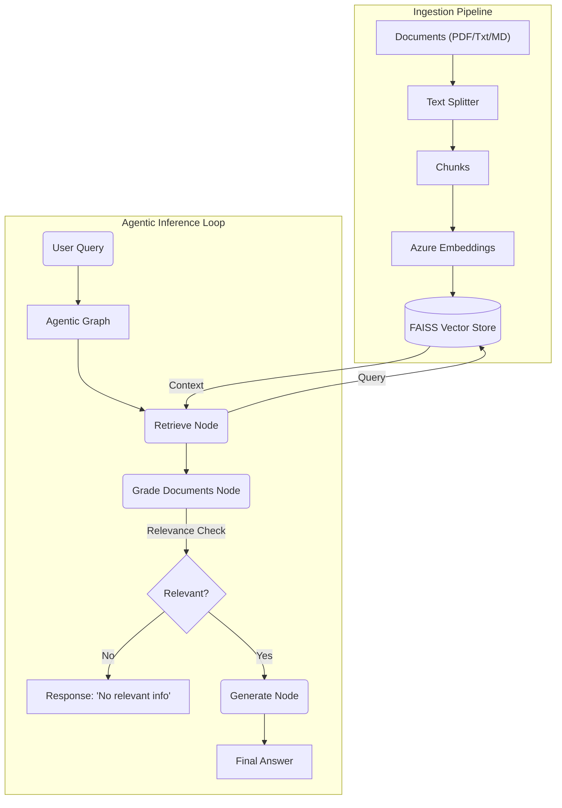

# Agentic RAG System for Domain Knowledge QA

## Overview
This project is a **Mini Agentic RAG (Retrieval-Augmented Generation) System** designed to answer domain-specific questions with high accuracy and minimal hallucinations. It leverages **Azure OpenAI** for LLM capabilities and **FAISS** for efficient vector retrieval. Unlike a standard RAG pipeline, this system features an **Agentic Loop** implemented with **LangGraph** that includes:
1.  **Retrieval**: Fetching relevant context.
2.  **Self-Reflection (Critic)**: Evaluating the relevance of retrieved documents.
3.  **Grounded Generation**: Answering only when validated context is present.
4.  **Conversational Memory**: Remembers previous turns to answer follow-up questions (e.g., "When was it founded?").
5.  **Token Optimization**: Strategies to minimize cost while maintaining performance.

## Video Demo

[](https://youtu.be/hrWiqbaq2t4)

> **Click the image above to watch the video demo!**

## System Architecture

The following diagram illustrates the high-level architecture and data flow:



## Workflow Explained

### 1. Ingestion Phase (`ingest.py`)
Before the system can answer questions, it must "learn" the domain knowledge.
1.  **Load**: The system scans the `data/` directory for supported files:
    *   Text (`.txt`)
    *   Markdown (`.md`)
    *   PDF (`.pdf`)
    *   CSV (`.csv`)
    *   Excel (`.xlsx`, `.xls`)
2.  **Split**: Documents are broken down into manageable chunks (e.g., 1000 characters) to fit within context windows and improve retrieval precision.
3.  **Embed**: Each chunk is converted into a vector embedding using Azure's `text-embedding-ada-002`.
4.  **Store**: These vectors are saved locally in a FAISS index (`faiss_index/`) for fast similarity search.

### 2. The Agentic Loop (`agent.py` & `main.py`)
When a user asks a question, the request enters a processing graph:

*   **Node 1: Retrieve**
    *   The user's query is converted to an embedding.
    *   The system searches the FAISS index for the top $k$ most similar document chunks.
*   **Node 2: Grade Documents (The "Critic")**
    *   Before blindly using the retrieved info, an LLM (Grader) reviews each chunk.
    *   It asks: *"Is this document chunk actually relevant to the user's question?"*
    *   Irrelevant chunks are discarded to prevent noise and hallucinations.
*   **Node 3: Generate**
    *   If relevant documents remain, the LLM generates a concise answer based **only** on those documents.
    *   If no documents pass the critique, the system honestly reports it cannot find the answer, rather than hallucinating.

## Project Structure

```text
.
├── app.py              # Streamlit Web Dashboard
├── agent.py            # Core LangGraph agent definitions (Nodes & Edges)
├── config.py           # Centralized configuration for Azure & Environment variables
├── data/               # Directory for source documents
├── docker-compose.yml  # Docker services config
├── Dockerfile          # Container definition
├── ingest.py           # Script to process documents and build the index
├── main.py             # CLI entry point for the chat interface
└── requirements.txt    # Python dependencies
```

## Setup & specific Instructions

### Prerequisites
- Python 3.10+
- Azure OpenAI API Access
- (Optional) Conda for environment management

### Installation

#### Option 1: Using venv (Standard Python)
1.  **Clone/Setup Project**
    ```bash
    python3 -m venv .venv
    source .venv/bin/activate
    pip install -r requirements.txt
    ```

#### Option 2: Using Conda
1.  **Create Environment**
    ```bash
    conda env create -f environment.yml
    ```
2.  **Activate Environment**
    ```bash
    conda activate agentic-rag
    ```

### Configuration

**CRITICAL**: Security best practices have been enforced. Hardcoded keys have been removed from `config.py`.

1.  **Create `.env` file**:
    Create a file named `.env` in the root directory. You can use the provided `.env.example` as a template.
    
    ```bash
    cp .env.example .env
    ```

2.  **Add your Secrets**:
    Open `.env` and fill in your keys:
    ```env
    AZURE_OPENAI_API_KEY=your_key_here
    AZURE_OPENAI_ENDPOINT=https://your-resource.openai.azure.com/
    AZURE_DEPLOYMENT_NAME=gpt-4o-mini
    AZURE_EMBEDDING_DEPLOYMENT=text-embedding-ada-002
    AZURE_OPENAI_API_VERSION=2024-08-01-preview
    
    # Optional: For Web Search
    TAVILY_API_KEY=tvly-xxxxxxxxxxxx
    ```

### Usage

**Step 1: Add Data**
Place your domain knowledge files (`.txt`, `.md`, `.pdf`, `.csv`, `.xlsx`) into the `data/` folder.

**Step 2: Build Index**
Run the ingestion script to process the data:
```bash
python ingest.py
```

**Step 3: Chat**
Start the interactive question-answering session:
```bash
python main.py
```
    - Type `exit` or `q` to quit.
    - **New**: Type `/add <path/to/file>` to upload a document instantly (e.g., `/add data/new_report.pdf`).

## Technologies Used
*   **LangGraph**: For orchestrating the stateful agent workflow.
*   **LangChain**: For document loading and chain primitives.
*   **FAISS**: For local, high-performance vector storage.
*   **Azure OpenAI**: For robust Embeddings and Chat completion.

## Troubleshooting

### Common Issues
1.  **DeploymentNotFound (404)**
    *   **Cause**: The Azure Deployment Name in `config.py` does not match your Azure resource.
    *   **Fix**: Update `AZURE_DEPLOYMENT_NAME` in `config.py` with the exact name from your Azure Portal (e.g., `gpt-4o`, `gpt-35-turbo`).

2.  **BadRequest (400) - json_schema**
    *   **Cause**: The Agent uses `structured_output` which requires a newer Azure API version.
    *   **Fix**: Ensure `AZURE_OPENAI_API_VERSION` in `config.py` is set to `2024-08-01-preview` or later.

3.  **Index Not Found**
    *   **Cause**: Running `main.py` before `ingest.py`.
    *   **Fix**: Run `python ingest.py` first to generate the `faiss_index`.
    
4.  **TavilySearchAPIWrapper Validation Error**
    *   **Cause**: `TAVILY_API_KEY` is missing or invalid.
    *   **Fix**: Add your key to `config.py` or export it as an environment variable (`export TAVILY_API_KEY=...`).

## Customization

*   **Change Chunking Strategy**: Modify `RecursiveCharacterTextSplitter` parameters in `ingest.py` (e.g., `chunk_size`, `chunk_overlap`) to tune how much context is retrieved.
*   **Adjust Prompts**: Edit the `system` prompts in `agent.py` to change the persona of the grader or the final answer generator.
*   **Add More Tools**: Extend the `AgentState` and `build_graph` in `agent.py` to include web search (e.g., Tavily) or other tools.

## Key Features Added

### 🧠 Conversational Memory
The system now supports stateful conversations.
- **Mechanism**: Uses `MemorySaver` from LangGraph to persist state.
- **Session**: Each run of `main.py` generates a unique `Session ID`.
- **Capability**: You can ask follow-up questions like "Tell me more about that" or "Who founded it?", and the agent will understand the context from previous messages.

### ⚡ Token Cost Optimization ("Low Cost Mode")
To ensure cost-efficiency, the following optimizations are enabled by default in `agent.py`:
1.  **Reduced Retrieval**: `k=2` (retrieves top 2 chunks instead of 4).
2.  **Context Window Management**: Only the last **6 messages** (approx. 3 turns) are sent to the LLM during answer generation.

*To revert to "High Performance Mode", edit `agent.py` to set `k=4` and remove the history slicing.*

### 🚀 Agentic Enhancements
To improve result quality and handle missing data:
1.  **Query Rewriting**: If initial retrieval fails to find relevant documents, the agent rewrites the user's question to be more search-friendly.
2.  **Web Search Fallback**: If the rewritten query still yields no local results, the agent attempts to search the web using **Tavily**.
    *   *Config*: Requires `TAVILY_API_KEY` in `config.py`. Skips gracefully if missing.

### ⚡ Real-time Token Streaming
The Streamlit interface now supports **Real-time Status Updates** ("Retrieving...", "Grading...") and robust answer streaming, ensuring you always know what the agent is currently doing.

### 💬 Smart Chitchat
The agent now includes a **Router Node** that intelligently distinguishes between:
*   **Domain Queries**: Uses RAG (e.g., "What is Project Omega?").
*   **Casual Chat**: Handles greetings ("Hi", "Thanks") directly without searching the database, making interactions faster and more natural.

### 🛡️ Robust Error Handling
*   **Content Safety**: Automatically handles Azure's "Responsible AI" policy violations by gracefully informing the user instead of crashing.
*   **Fallback Logic**: If the router fails, it safely defaults to general conversation.

## 📊 Streamlit Dashboard & Deployment

### Run Locally
To stick to the visual interface instead of the terminal:
```bash
streamlit run app.py
```
Open [http://localhost:8501](http://localhost:8501) in your browser.
*   **Upload**: Use the sidebar to upload files instantly.
*   **Chat**: Interact with the agent naturally.

### 🐳 Run with Docker (Recommended)
Deployment is easy with Docker Compose.
1.  **Build & Run**:
    ```bash
    docker-compose up --build
    ```
2.  **Access**:
    Go to [http://localhost:8501](http://localhost:8501).
    The system will persist your data in the `data/` volume.
